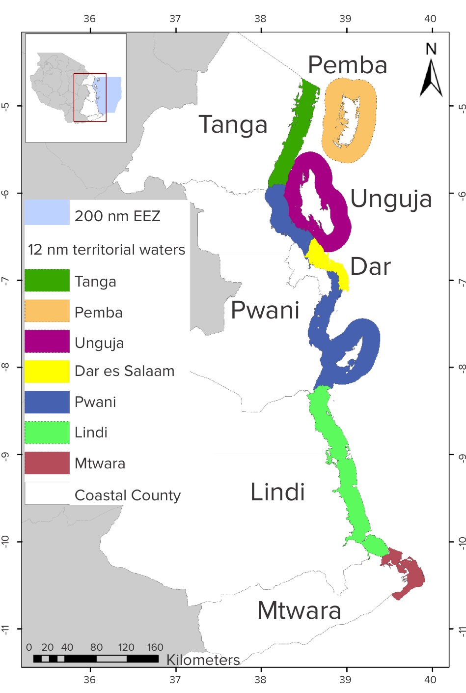

<!--- please edit as needed!--->

----

## Why is this study being done in Tanzania?

There is a need to assess and track the oceans comprehensively in Tanzania by combining the best available social, economic, and environmental information. This can help chart a path forward to increase economic opportunities and human well being while sustainably managing these critical resources.

The ocean plays a significant role in socioeconomic development of the United Republic of Tanzania by supporting key economic sectors such as fisheries, tourism, and shipping as well as its rich cultural heritage. However, the growing interest and inevitable investment in the ‘Blue Economy’ within a changing climate and growing population, poses considerable risks. An OHI analysis can help to align actors from diverse sectors and across scales, to ensure sustainable use of the ocean for future prosperity.

 

## What is the timeline and spatial scale of this project?

The assessment is at the county scale.

  

 

## What year does this OHI assessment represent?  

The assessment will be completed in 2018. 

 

