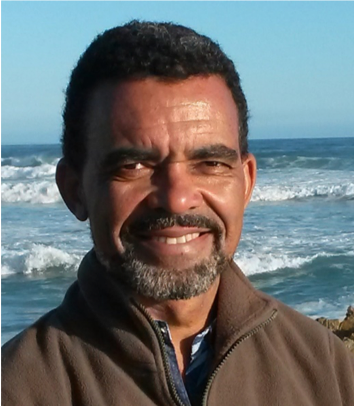
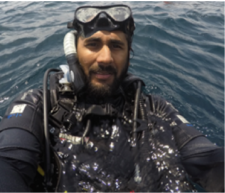
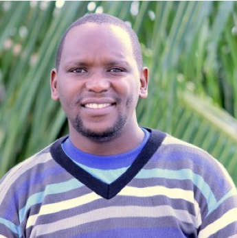
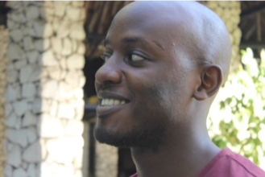
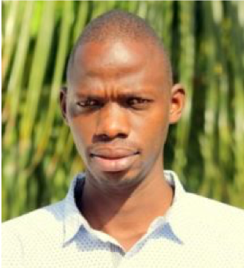

<!--- please update--->

----
##David Obura

 

   

David Obura is a Founding Director of CORDIO East Africa, a knowledge organization supporting sustainability of coral reef and marine systems in the Western Indian Ocean (WIO). David oversaw the OHI implementation by the CORDIO team, having engaged with OHI since its early formative days in 2009 and has been working to bring to East Africa in the last years to help promote integrated approaches to marine management. CORDIO takes research to management and policy, builds capacity, and works with stakeholders, managers and policy makers. David's primary research is on coral reef resilience, in particular to climate change, and the biogeography of the Indian Ocean. David works to integrate conservation and development through inclusive blue economy principles and links provided by SDG goals and targets. In this, he hopes the OHI will provide tangible mechanisms for considering multiple targets and sectors together.
Email: dobura@cordioea.net

  
  

##Mishal Gudka

 

   

Mishal has a background in conservation ecology, and his interests lie in conducting science which can be applied to the conservation and improved management of nature. Mishal works as a data analyst and coral reef scientist with CORDIO. He led the planning and implementation of the technical aspects of the OHI, and general coordination and management of the project. In his 3 years at CORDIO, he has worked on regional data aggregation and reporting efforts related to coral reef health and the impacts of coral bleaching. This has helped him become well versed (and secretly a bit of an enthusiast) with the use of R - which proved imperative for the OHI work; particular when preparing and formatting layers, as well as understanding toolbox and goal calculation functions. Mishal spent time exploring the details of the toolbox, and in doing so improved his R coding skills. The highlight of the project was the interest some decision makers showed towards the OHI framework particularly its suitability for their environmental reporting processes. 
Email: mgudka@cordioea.net	

  

##Lenice Ojwang

 

   
Lenice dealt with stakeholder engagement and governance aspects of the preliminary OHI assessments in Kenya and Tanzania. Her work revolves around multilevel climate change adaptation governance, integrated coastal management and community based natural resource management. She holds a bachelor's degree in Environmental Science from Kenyatta University. She is currently pursuing a Masters degree in Project Management at the Jomo Kenyatta University of Science and Technology with the aim of addressing some of the challenges she has experienced working in the science-policy-practice interface. She perceives her background in Environmental Science as an open "cheque" that has allowed her to work with different frameworks on broad environmental issues including climate change, waste management, marine ecosystem conservation.
Email: lojwang@cordioe.net 

  

##James Mbugua

 

 

James led the geo-spatial analysis work including developing various spatially explicit pressure and resilience indicators for the 2 sub-goals assessed, assessing mangrove habitat cover from satellite images and producing the spatial-scale maps for each country. 
James joined CORDIO East Africa in 2014 as a Research assistant and has since perfected his spatial analysis skills to the position of GIS expert. James is currently the GIS lead overseeing CORDIO spatial facility/lab and he is involved in spatial analysis and interpretation of Earth Observation products as well as establishment, development and maintenance of various GIS products such as web portals, web map applications and story maps.
James holds a Bachelor's degree and a Diploma in Environmental Management from Kampala International University
Email: jmbugua@cordioea.net 

  

##Randall Mabwa

 

 

Randy offered technical support through data mining and analysis, working mostly on the fisheries stock assessment and overarching goal pressures and resilience data, that fed into the preliminary OHI assessments for Kenya and Tanzania. He holds a bachelor's degree in Marine Biology and Fisheries from Pwani University and opines that the Ocean Health Index can be applied to improve conservation and policy decisions in East Africa if the OHI Kenya and Tanzania recommendations to improve data collection and sharing are implemented. 
Emnail: rmabwa@cordioea.net 

  

##Clay Obota

 

 

Clay Obota was involved in the Fisheries goal assessment through facilitating the process of data acquisition and assessing appropriate models based on the existing fisheries data from the various sources in Kenya and Tanzania. 
He earned his B.Sc. in Fisheries and Aquatic Sciences from Moi University and a Master's degree in Fisheries from Pwani University. Previously Clay has worked on projects focusing on the linkage between ecology and socio economics of small scale fisheries. 
Currently, he is involved in Sharks and Rays management and conservation work, as well as working with coastal communities in developing innovative ways to enhance their resilience to changing coastal and marine resources. His research interests lie at the connection of innovative marine science and applied management solutions to fishing communities. 
Email: cobota@cordioea.net	

